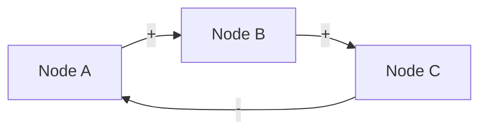
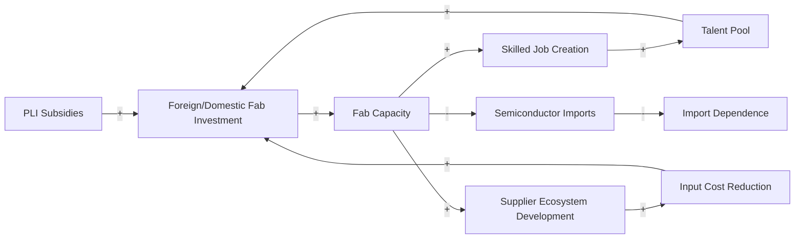

# Causal Loop Analysis

Extract the implicit causal claims in a policy argument and make them explicit: a Mermaid diagram showing how the argument works, what feedback loops it contains, which links are unsupported, and what second-order effects it ignores.

## Why This Matters

Every policy argument contains a theory of change: "if we do X, then Y will follow." These causal chains are often:
- Assumed rather than argued
- Linear when they are actually circular (feedback loops)
- Missing second-order effects and unintended consequences
- Overstated in their certainty ("X will cause Y" vs. "X is associated with Y under conditions A and B")

Making causal structure explicit forces the author to:
- Defend every causal link
- Acknowledge feedback loops that may dampen or amplify the intended effect
- See second-order consequences before a reviewer does

---

## Vocabulary

| Symbol | Meaning |
|--------|---------|
| `-->|+|` | Positive link: A increases → B increases (or A decreases → B decreases) |
| `-->|-|` | Negative link: A increases → B decreases (or vice versa) |
| `-->|~+|` | Positive link with delay |
| `-->|~-|` | Negative link with delay |
| **R loop** | Reinforcing loop: A → B → A (amplifying — virtuous or vicious cycle) |
| **B loop** | Balancing loop: A → B → -A (stabilizing or constraining) |

---

## Process

### Step 1: Extract Causal Claims
Read the piece and list every causal claim, explicit or implicit.
- Explicit: "PLI subsidies will attract foreign investment"
- Implicit: (if the argument is that PLI → jobs, there is an implicit link: foreign investment → jobs)

For each claim, note:
- Source node → Target node
- Link direction (positive or negative)
- Is there a delay?
- Is this link cited/evidenced, or assumed?

### Step 2: Build the Mermaid Diagram
Render the causal structure as a Mermaid flowchart. Use `flowchart LR` (left to right) for linear chains; `flowchart TD` (top down) for hierarchical structures.



Keep node labels short and concrete. Avoid abstractions as node names.

### Step 3: Identify Loops
Walk through the diagram and identify:
- **Reinforcing loops (R)**: Where does a causal chain circle back and amplify the original node?
- **Balancing loops (B)**: Where does a causal chain circle back and dampen the original node?

Label each loop: R1, R2, B1, B2 etc. Describe what each loop means in plain language.

### Step 4: Flag Unsupported Links
For each causal link in the diagram:
- Is this link cited in the piece, or assumed?
- If assumed: is it reasonable (well-established in the literature) or contested?
- Mark contested/uncited links explicitly.

### Step 5: Identify Missing Links (Second-Order Effects)
What happens *after* the intended causal chain ends? What effects does the argument not trace?
- Does the intervention have unintended consequences in adjacent domains?
- Are there time-horizon effects (short-run positive, long-run negative, or vice versa)?
- What happens if a key assumption fails?

### Step 6: Identify Leverage Points
Where in the causal map could intervention be most effective? (Meadows' hierarchy of leverage points — simplified):
- Breaking a vicious reinforcing loop
- Strengthening a virtuous reinforcing loop
- Reducing a balancing loop's resistance
- Changing a key parameter in the chain

---

## Output Format

```
## Causal Loop Analysis

### Causal Map

```mermaid
flowchart LR
  [nodes and links here]
```

### Loop Inventory
| ID | Type | Nodes | Plain language description |
|----|------|-------|---------------------------|
| R1 | Reinforcing | A → B → A | [what this cycle means] |
| B1 | Balancing | A → C → -A | [what this constrains] |

### Unsupported Links
| Link | Issue | Recommendation |
|------|-------|---------------|
| A → B | Assumed; no citation | Cite [source type] or qualify with "may" |

### Missing Second-Order Effects
[What the argument doesn't trace that a reviewer might raise]

### Leverage Points
[Where in this causal map is intervention most powerful]

### Key Causal Vulnerabilities
[1–3 links in the chain that, if broken, would undermine the central argument]
```

---

## Notes on Mermaid in Obsidian and GitHub

- Mermaid diagrams render natively in Obsidian (no plugin needed in newer versions).
- GitHub Markdown renders Mermaid in `.md` files natively.
- For Google Docs: export the Mermaid code and render via mermaid.live, then paste as image.
- Keep node count under 15 for readability. For complex arguments, break into sub-diagrams.

---

## Example (Semiconductor PLI argument)

Argument: "India's PLI scheme for semiconductors will attract fab investment, which will create skilled jobs, develop supplier ecosystems, and ultimately reduce import dependence."



**R1** (Reinforcing): PLI → Investment → Ecosystem → Cost reduction → Investment. Virtuous cycle — but takes 5–10 years to materialize.
**R2** (Reinforcing): Investment → Talent pool → Investment. Slower cycle; depends on education pipeline.

**Unsupported link**: B → C assumes subsidy is sufficient to overcome India's infrastructure and ecosystem gaps. This is the most contested link in the literature.

**Missing effect**: What happens to existing chip design firms if fab costs remain uncompetitive despite PLI? Import substitution for fabs may not reduce design-side import dependence.
