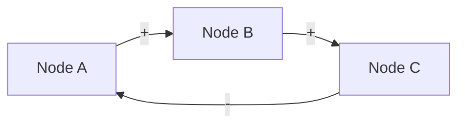
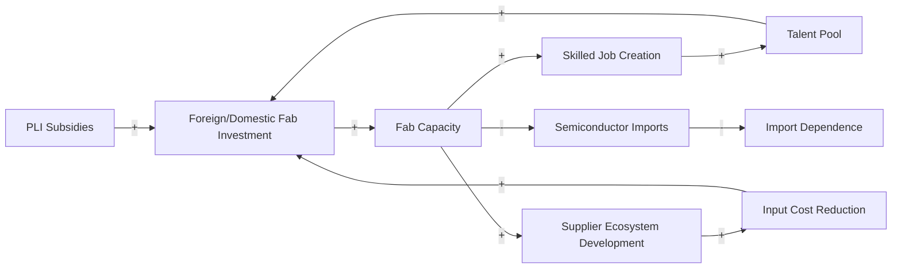

# Causal Loop Analysis

Extract the implicit causal claims in a policy argument and make them fully explicit — as a named-loop Mermaid diagram with cross-connections, a layer model where applicable, structural actor positions, and a ranked leverage point menu. This is the Takshashila publication standard for causal analysis.

## Why This Matters

Every policy argument contains a theory of change: "if we do X, then Y will follow." These causal chains are often:
- Assumed rather than argued
- Linear when they are actually circular (feedback loops)
- Missing second-order effects and unintended consequences
- Overstated in their certainty ("X will cause Y" vs. "X is associated with Y under conditions A and B")

Making causal structure explicit forces the author to:
- Defend every causal link
- Acknowledge feedback loops that may dampen or amplify the intended effect
- See second-order consequences before a reviewer does

---

## Vocabulary

| Symbol | Meaning |
|--------|---------|
| `-->|+|` | Positive link: A increases → B increases (or A decreases → B decreases) |
| `-->|-|` | Negative link: A increases → B decreases (or vice versa) |
| `-->|~+|` | Positive link with delay |
| `-->|~-|` | Negative link with delay |
| **R loop** | Reinforcing loop: A → B → A (amplifying — virtuous or vicious cycle) |
| **B loop** | Balancing loop: A → B → -A (stabilizing or constraining) |

---

## Process

### Step 0: State the Core Causal Chain

Before drawing loops, state the argument's central causal logic as a single sentence chain:

> "deny X → deny Y → deny Z"
> "subsidise A → attract B → generate C → reduce D"

Then ask: **which link is the weakest?** Which link, if broken, would collapse the entire argument?

This step forces clarity before complexity. Do not skip it.

### Step 1: Extract Causal Claims
Read the piece and list every causal claim, explicit or implicit.
- Explicit: "PLI subsidies will attract foreign investment"
- Implicit: (if the argument is that PLI → jobs, there is an implicit link: foreign investment → jobs)

For each claim, note:
- Source node → Target node
- Link direction (positive or negative)
- Is there a delay?
- Is this link cited/evidenced, or assumed?

### Step 2: Build the Mermaid Diagram
Render the causal structure as a Mermaid flowchart. Use `flowchart LR` (left to right) for linear chains; `flowchart TD` (top down) for hierarchical structures.


```mermaid
flowchart LR
  A[Node A] -->|+| B[Node B]
  B -->|+| C[Node C]
  C -->|-| A
```

Keep node labels short and concrete. Avoid abstractions as node names.

### Step 3: Identify and Name Loops

Walk through the diagram and identify all feedback loops. For each:
- **Type**: Reinforcing (R) or Balancing (B)
- **Label**: R1, R2, B1, B2 etc.
- **Descriptive name**: Give each loop a plain-language name that captures its character. Not just "R1" — name it (e.g. "indigenous acceleration loop", "ecosystem flywheel", "debt-trap spiral", "talent exodus cycle"). The name should be memorable and explain what the loop does.
- **One-sentence description**: What does this loop do, and what would break it?

Example:
- **R1 "Indigenous Acceleration Loop"**: China's substitution efforts increase AI output on own hardware, which validates further substitution investment, which increases output again. Breaking this loop would require showing that domestic hardware cannot scale.
- **R2 "Ecosystem Flywheel"**: US chip exports to China feed industry revenue, which funds R&D, which produces better chips, which attract more exports. Cross-connection: China's R1 output directly undermines this by eroding US market share.

### Step 3b: Map Cross-Connections Between Loops

The most analytically important insight is often where one loop undermines or amplifies another.

For each pair of loops, ask:
- Does output from Loop A feed into Loop B (amplification)?
- Does output from Loop A undercut a node in Loop B (erosion)?

State cross-connections explicitly:
> "China's domestic AI output (R1) directly erodes US chip industry revenue — a key node in R2's ecosystem flywheel. This cross-connection means that R1 and R2 are structurally antagonistic: the stronger R1 gets, the weaker R2 becomes."

Cross-connections are the strategic insight. Surface them prominently.

### Step 3c: Layer Model (if applicable)

If the system has stacked interdependencies — where one layer must exist before the next can function — name the layers and show which layer the intervention targets.

Example (AI compute):
> Layer 1: Energy → Layer 2: Chips → Layer 3: Infrastructure → Layer 4: Models → Layer 5: Applications

Show: Which layer does this intervention target? What adaptation pressure does it create on other layers? Can actors substitute within a layer or must they build the whole stack?

### Step 4: Flag Unsupported Links
For each causal link in the diagram:
- Is this link cited in the piece, or assumed?
- If assumed: is it reasonable (well-established in the literature) or contested?
- Mark contested/uncited links explicitly.

### Step 5: Identify Missing Links (Second-Order Effects)
What happens *after* the intended causal chain ends? What effects does the argument not trace?
- Does the intervention have unintended consequences in adjacent domains?
- Are there time-horizon effects (short-run positive, long-run negative, or vice versa)?
- What happens if a key assumption fails?

### Step 6: Identify Leverage Points
Where in the causal map could intervention be most effective? (Meadows' hierarchy of leverage points — simplified):
- Breaking a vicious reinforcing loop
- Strengthening a virtuous reinforcing loop
- Reducing a balancing loop's resistance
- Changing a key parameter in the chain

Also identify **external leverage points** — constraints or actors outside the causal diagram that could shift the system (e.g., US export controls in a semiconductor analysis, an IMF condition in a fiscal analysis, a judicial ruling in a regulatory analysis).

### Step 6b: Rank Leverage Points

After identifying leverage points, rank each on two dimensions:

**Magnitude** — how much does intervening here change system behaviour?
- High: Breaking or strengthening this would fundamentally shift the outcome
- Medium: Meaningful improvement but other constraining loops remain
- Low: Marginal effect; other parts of the system absorb the change

**Accessibility** — how feasible is intervention here given political, institutional, and technical constraints?
- High: Within the mandate of a single actor; no major political barriers
- Medium: Requires coordination across actors; politically contested but possible
- Low: Requires overcoming deeply entrenched interests or changing parameters outside domestic control

Plot each leverage point on a 2×2 (Magnitude × Accessibility). **Top-right quadrant (High × High) = priority interventions.**

Note: High-magnitude but low-accessibility leverage points are worth naming even if not actionable — they clarify why easy interventions fail.

### Step 7: Policy Intervention Menu

Translate the ranked leverage points into concrete, actor-specific recommendations:

For each priority leverage point:
- "To break loop [R1]: [specific intervention] — who must act, what they must do"
- "To strengthen loop [B1]: [specific intervention]"
- Distinguish: **necessary conditions** (without which the outcome is impossible) from **sufficient conditions** (alone enough to achieve the outcome)
- Note: interventions targeting contested causal links are risky leverage — flag if the link itself is unsupported

---

## Output Format

```
## Causal Loop Analysis

### Core Causal Chain

[State the argument's central logic as a single sentence chain]
> "X → Y → Z"

**Weakest link:** [Which link, if broken, collapses the argument?]

### Causal Map

```mermaid
flowchart LR
  [nodes and links here]
```

### Loop Inventory

| ID | Name | Type | Nodes | What sustains it | What breaks it |
|----|------|------|-------|-----------------|----------------|
| R1 | "[Descriptive name]" | Reinforcing | A → B → A | [driver] | [breaking condition] |
| R2 | "[Descriptive name]" | Reinforcing | B → C → B | [driver] | [breaking condition] |
| B1 | "[Descriptive name]" | Balancing | A → C → -A | [what it constrains] | [what overwhelms it] |

### Cross-Connections Between Loops

[For each pair of interacting loops:]
> "Loop R1's output [node X] directly [undermines/amplifies] a key node in Loop R2. This means R1 and R2 are structurally [antagonistic/synergistic]: the stronger R1 gets, the [weaker/stronger] R2 becomes."

### Layer Model (if applicable)

> Layer 1: [foundation] → Layer 2: [next] → Layer 3: [next] → Layer 4: [output layer]

- Which layer does this intervention target?
- What adaptation pressure does it create on adjacent layers?
- Can actors substitute within a layer, or must they build the whole stack?

### Structural Actor Positions

[Where does each key actor sit in the causal map?]
- Actor A: [position, e.g. "consumer-integrator — benefits from Layer 4 outputs but does not control Layers 1–2"]
- Actor B: [position]

### Unsupported Links

| Link | Issue | Recommendation |
|------|-------|---------------|
| A → B | Assumed; no citation | Cite [source type] or qualify with "may" |

### Missing Second-Order Effects

[What the argument doesn't trace that a reviewer might raise]

### Leverage Points

| Leverage Point | Loop Affected | Mechanism | Magnitude | Accessibility | Priority |
|---------------|--------------|-----------|-----------|---------------|---------|
| [Intervention] | R1 | [How it affects the loop] | High/Med/Low | High/Med/Low | 1/2/3 |

**Priority matrix:**

```
              LOW ACCESSIBILITY    HIGH ACCESSIBILITY
HIGH MAGNITUDE   Important but       Priority
                 hard — name it      interventions
                 anyway

LOW MAGNITUDE    Deprioritise        Easy wins
```

### Policy Intervention Menu

**Priority interventions (High magnitude × High accessibility):**
- To [break/strengthen] loop [ID] ("[loop name]"): [Specific intervention] — Actor: [who] / Action: [what]
  - Necessary condition? Yes / No
  - Risk: [if this causal link is contested or unsupported]

**Important but difficult (High magnitude × Low accessibility):**
- [Intervention] — blocked by [constraint]. Worth naming to explain why easier interventions fail.

**External leverage points:**
- [Constraint or actor outside the causal diagram that shapes the system]

### Key Causal Vulnerabilities

[1–3 links in the chain that, if broken, would undermine the central argument — flag which of these are also contested/unsupported links]
```

---

## Notes on Mermaid in Obsidian and GitHub

- Mermaid diagrams render natively in Obsidian (no plugin needed in newer versions).
- GitHub Markdown renders Mermaid in `.md` files natively.
- For Google Docs: export the Mermaid code and render via mermaid.live, then paste as image.
- Keep node count under 15 for readability. For complex arguments, break into sub-diagrams.

---

## Example (Semiconductor PLI argument)

Argument: "India's PLI scheme for semiconductors will attract fab investment, which will create skilled jobs, develop supplier ecosystems, and ultimately reduce import dependence."

### Core Causal Chain

> "PLI subsidies → fab investment → domestic capacity → reduced import dependence"

**Weakest link:** PLI subsidies → fab investment. Subsidy alone does not overcome India's infrastructure and ecosystem gaps; this is the most contested step.

### Causal Map


```mermaid
flowchart LR
  A[PLI Subsidies] -->|+| B[Foreign/Domestic Fab Investment]
  B -->|+| C[Fab Capacity]
  C -->|+| D[Skilled Job Creation]
  C -->|+| E[Supplier Ecosystem Development]
  E -->|+| F[Input Cost Reduction]
  F -->|+| B
  C -->|-| G[Semiconductor Imports]
  G -->|-| H[Import Dependence]
  D -->|+| I[Talent Pool]
  I -->|+| B
```

### Loop Inventory

| ID | Name | Type | Nodes | What sustains it | What breaks it |
|----|------|------|-------|-----------------|----------------|
| R1 | "Ecosystem Flywheel" | Reinforcing | Investment → Ecosystem → Cost Reduction → Investment | Domestic supplier density | Persistent infrastructure gaps that keep input costs high despite ecosystem growth |
| R2 | "Talent Accumulation Loop" | Reinforcing | Investment → Talent Pool → Investment | Education pipeline depth | Brain drain; failure to retain talent domestically |

### Cross-Connections Between Loops

R1 and R2 share the Investment node — both loops strengthen when investment rises. However, R2 runs on a slower clock than R1: the education pipeline takes 8–12 years. This timing mismatch means R1 can stall before R2 provides enough talent to reinforce it, creating a window of fragility where neither loop is self-sustaining.

### Layer Model

> Layer 1: Land/Power → Layer 2: Equipment Supply → Layer 3: Fab Capacity → Layer 4: Chip Output → Layer 5: Design Applications

PLI targets Layer 3 directly. Adaptation pressure falls on Layers 1–2 (India's infrastructure deficit) and Layer 5 (existing chip design firms may not benefit from fab-side import substitution). Actors cannot easily substitute within Layer 2 — equipment is controlled by a small number of US/Dutch/Japanese suppliers.

### Structural Actor Positions

- **India**: Positioned at Layer 5 (design/applications) with aspiration to build Layer 3. Does not yet control Layers 1–2.
- **Foreign fabs (TSMC, Micron)**: Gatekeepers of Layer 3; their investment decisions determine whether the R1 loop fires at all.
- **Equipment suppliers (ASML, Applied Materials)**: Structural chokepoint at Layer 2; outside India's direct policy reach.

### Unsupported Links

| Link | Issue | Recommendation |
|------|-------|---------------|
| PLI subsidies → Fab investment | Assumes subsidy overcomes infrastructure/ecosystem gaps | Cite comparative PLI evidence from Vietnam/Malaysia fabs or qualify with "contingent on infrastructure co-investment" |
| Fab capacity → Supplier ecosystem | Assumes local supplier density will emerge; may not if global supply chains remain cheaper | Cite component localisation data from existing Indian electronics PLI |

### Missing Second-Order Effects

- Chip design firms may not benefit from fab-side import substitution — design-side import dependence persists.
- If fabs remain uncompetitive on cost after PLI, the R1 loop stalls but government subsidy commitment continues (fiscal drain without strategic gain).
- Talent trained for semiconductor fabs may emigrate, weakening R2.

### Key Causal Vulnerabilities

1. **PLI subsidies → Fab investment** (weakest link; contested): If foreign fabs judge India's infrastructure inadequate, the entire chain fails at step one.
2. **Fab capacity → Supplier ecosystem** (assumed; slow): Supplier ecosystems take 15+ years in comparable cases; the PLI timeline may be too short for this link to fire.
3. **Talent Pool → Investment** (delayed): R2 depends on an education pipeline that does not yet exist at scale for advanced semiconductor manufacturing.
