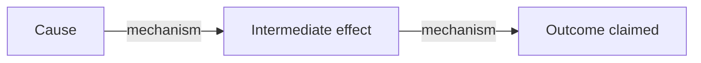

# Hypothesis Development

Turn a researcher's intuition or argument into a rigorous, testable claim — with the assumptions mapped, evidence requirements specified, and the implied causal model made explicit. The output (a Research Brief) anchors everything that follows: literature search, stakeholder mapping, causal analysis, and drafting.

## When to Use This Skill

**Entry Point A — Researcher already has a hypothesis:**
Run this skill first, then use the Research Brief to guide source-gathering and drafting.

**Entry Point B — Researcher has done exploratory reading:**
Run this after `/zotero-review` or `/parliament-search` to crystallize what the evidence suggests into a testable claim.

In both cases, this skill must be run **before drafting**. A piece without a tested hypothesis is an opinion. A piece with one is an argument.

---

## The Core Distinction

| Type | Example | How to Handle |
|------|---------|---------------|
| **Empirical claim** | "India's semiconductor imports grew 40% in five years" | Check and cite |
| **Causal claim** | "PLI subsidies will attract fab investment because..." | Map mechanism, identify assumptions |
| **Normative claim** | "India should invest in semiconductors" | Flag: needs a separate values argument |
| **Definitional claim** | "By 'chip' I mean logic chips, not memory" | Make explicit in the draft |

Most policy arguments conflate these. Separating them makes the argument stronger and the evidence requirements clearer.

---

## Process

### Step 1: Elicit and Refine the Hypothesis

Ask the researcher: "State your hypothesis in one sentence."

Apply three tests:
1. **Falsifiability test**: "What would have to be true to prove you wrong?" If the researcher cannot answer, the hypothesis is not yet testable. Push back until it is.
2. **Scope test**: Is the claim bounded in time, geography, and domain? ("India's PLI scheme will fail" is too broad. "India's PLI scheme for semiconductors will not achieve its 2026 investment targets because domestic demand is insufficient" is testable.)
3. **Causal test**: Does the hypothesis contain a mechanism, or just a correlation? ("X and Y are correlated" is not a hypothesis. "X causes Y through mechanism Z" is.)

Refine the hypothesis until it passes all three tests.

### Step 2: Decompose into Claim Types

Break the refined hypothesis into its component claims:

- **Empirical claims** — factual assertions that can be checked against data or evidence
- **Causal claims** — "A causes B because of mechanism C" — requires a model
- **Normative claims** — value judgements (flag these separately; they need different kinds of argument)
- **Definitional claims** — how key terms are being used (clarify these upfront to prevent straw-manning)

For each causal claim: state it as "X → Y because [mechanism]."

### Step 3: Surface the Implied Model

Every policy hypothesis implies a theory of how the world works. Make it explicit.

From the causal claims extracted in Step 2, construct the implied causal chain:

> "Your hypothesis implies: [Node A] → [Node B] → [Node C], with [Condition X] and [Condition Y] as necessary conditions for each link to hold."

Generate a skeleton Mermaid diagram showing the key causal path (this feeds directly into `/causal-loop-analysis`):



Note: this is a *skeleton*, not a complete causal map. The full map is developed in `causal-loop-analysis`.

### Step 4: Map Assumptions and Falsification

For each causal link in the skeleton model:

**Assumption mapping:**
- "What must be true for this link to hold?"
- List 2–4 assumptions per link
- Rank assumptions by fragility: "If this assumption is wrong, does the argument collapse or just weaken?"

**Falsification:**
- "What evidence would disprove this link?"
- "What is the single most damaging piece of counterevidence that could exist?"
- "What alternative explanation would produce the same outcome without your mechanism?"

This produces the Assumptions Map (see `references/assumptions-map-template.md`).

### Step 5: Generate Evidence Requirements

Based on the claim decomposition and assumption map, generate a concrete research agenda:

**For each empirical claim:**
- "What data or source would confirm/disconfirm this?"
- "What is the most authoritative source for this claim in the Indian context?" (→ trigger `/parliament-search` or `government-source-finder`)

**Priority ranking:**
- "The most important evidence gap is: [X]" — what, if missing, makes the argument unpublishable
- "The most dangerous counterevidence would be: [Y]" — what a hostile reviewer would cite

**Source suggestions:**
- Parliamentary committee reports → `/parliament-search [topic]`
- Academic papers → `/zotero-review`
- Government data → `government-source-finder` agent

### Step 6: Actor Implications

Every hypothesis has political economy implications — someone benefits from it being true or false.

- "Who has the strongest interest in your hypothesis being wrong?" (potential challengers)
- "Which actor's behaviour is the hypothesis most dependent on?" (critical actors)
- "Who is your argument trying to persuade?" (target audience)

This hands off to `stakeholder-analysis` for full mapping.

---

## Output: Research Brief

Produce a structured 1-page Research Brief that anchors the entire research project:

```
## Research Brief

### Hypothesis
[Refined, falsifiable hypothesis — one sentence]

### Claim Decomposition
**Empirical claims:**
- [Claim 1] — Source needed: [type of source]
- [Claim 2] — Source needed: [type of source]

**Causal claims:**
- [A → B because mechanism C] — Assumption: [X must hold]
- [B → Outcome because mechanism D] — Assumption: [Y must hold]

**Normative claims (flagged):**
- [Any value judgements embedded in the argument]

### Implied Causal Model (skeleton)
[Mermaid flowchart showing key causal chain]

### Key Assumptions (ranked by fragility)
1. [Most fragile] — Breaks if: [condition]
2. [...]
3. [Most robust] — Breaks only if: [condition]

### Falsification Condition
[What would have to be true to disprove the hypothesis — stated as specifically as possible]

### Competing Hypotheses
- [Alternative explanation 1 that produces the same outcome]
- [Alternative explanation 2]

### Evidence Requirements
**Must-have (argument unpublishable without):**
- [Evidence item 1]

**Should-have (strengthens argument significantly):**
- [Evidence item 2]

**Nice-to-have:**
- [Evidence item 3]

### Actor Analysis (brief)
- Strongest challenger: [who and why]
- Critical actor: [whose behaviour the hypothesis depends on]
- Target audience: [who the argument is trying to persuade]

### Next Steps
- [ ] Run `/parliament-search [topic]` for [specific claims]
- [ ] Run `stakeholder-analysis` for full actor mapping
- [ ] Run `causal-loop-analysis` using the skeleton causal model above
- [ ] Run `/zotero-review` for [specific academic literature]
```

---

## Quality Checklist

- [ ] Hypothesis passes falsifiability test — researcher can state what would disprove it
- [ ] Hypothesis has bounded scope (time, geography, domain)
- [ ] Empirical claims separated from causal claims from normative claims
- [ ] Each causal link has a stated mechanism (not just correlation)
- [ ] At least two competing hypotheses identified
- [ ] Most fragile assumption named
- [ ] Evidence requirements are specific (not "find more data")
- [ ] Next steps are actionable commands, not vague instructions

---

## Common Pitfalls in Policy Hypotheses

**Hypothesis is actually a conclusion:** "India should invest in semiconductors" — this is where you want to end up, not where you start. What's the causal claim that leads here?

**Mechanism is a black box:** "Subsidies → Growth" without explaining how. Break the mechanism into steps.

**Time horizon mismatch:** Causal claim is long-run, evidence sought is short-run (or vice versa). Specify the time horizon explicitly.

**Scope too wide:** "Geopolitics affects trade" — unfalsifiable in practice. "US export controls on advanced chips reduced China's AI model training capacity by [X] between 2022 and 2024" — testable.

**Normative smuggling:** Empirical-sounding claims that embed a value judgment. "Domestic semiconductor manufacturing is necessary for strategic autonomy" — "necessary" and "strategic autonomy" are normative. Unpack them.
