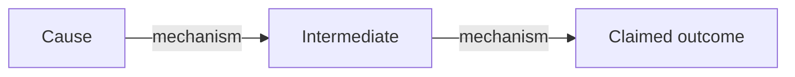

# Research Brief Template

*Fill this in as you work through the hypothesis-development skill. This document anchors all subsequent research steps.*

---

**Project:** [Research project name]
**Date:** [Date]
**Researcher:** [Name]
**Target output:** [Op-ed / Policy brief / Discussion document / Grant proposal]

---

## Hypothesis

> [Refined, falsifiable hypothesis — one sentence. Must pass: falsifiability test, scope test, causal test.]

---

## Claim Decomposition

**Empirical claims** (can be checked against data/evidence):
- [ ] [Claim] — Source needed: [type of source, e.g., "MeitY data", "parliamentary committee report"]
- [ ] [Claim] — Source needed: [...]

**Causal claims** (A causes B through mechanism C):
- [Node A] → [Node B] because [mechanism] — Assumption: [what must hold]
- [Node B] → [Outcome] because [mechanism] — Assumption: [what must hold]

**Normative claims** (value judgements — handle separately):
- [Any "should", "ought", "necessary", "important" claims]

**Definitional claims** (how key terms are defined):
- "[Term]" means [definition] in this argument
- "[Term]" is limited to [scope] — not [what it excludes]

---

## Implied Causal Model (skeleton)

*Develop this further with `causal-loop-analysis`*

---

## Key Assumptions (ranked by fragility — most fragile first)

| # | Assumption | Breaks if... | Fragility |
|---|-----------|-------------|-----------|
| 1 | [Most fragile] | [Condition] | High |
| 2 | [...] | [...] | Medium |
| 3 | [Most robust] | [Condition] | Low |

---

## Falsification Condition

> [What would have to be empirically true to disprove this hypothesis — stated as specifically as possible]

---

## Competing Hypotheses

- **Alternative 1:** [Different explanation that produces the same outcome without your mechanism]
- **Alternative 2:** [...]
- *Why this hypothesis is more persuasive than Alternative 1:* [...]

---

## Evidence Requirements

**Must-have** (argument unpublishable without):
- [ ] [Specific evidence item, not "data on X" but "NASSCOM 2024 report on chip imports" or equivalent]

**Should-have** (significantly strengthens argument):
- [ ] [Evidence item]

**Nice-to-have** (adds richness but not essential):
- [ ] [Evidence item]

---

## Actor Analysis (brief)

- **Strongest challenger:** [Who would most want this hypothesis to be wrong, and why]
- **Critical actor:** [Whose behaviour the hypothesis most depends on]
- **Target audience:** [Who the argument is trying to persuade]

*Develop this further with `stakeholder-analysis`*

---

## Next Steps

- [ ] `/parliament-search [topic]` — for [specific claims]
- [ ] `stakeholder-analysis` — for full actor mapping
- [ ] `causal-loop-analysis` — use skeleton causal model above as starting point
- [ ] `/zotero-review` — for [specific academic literature needed]
- [ ] [Other steps]
